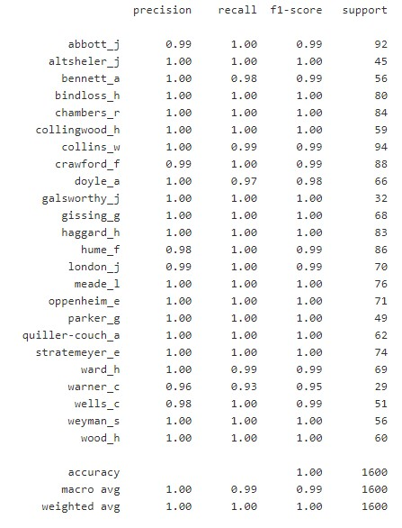

# Predict-author-not-using-content-but-using-function-words
Machine learning classifier to predict author from a piece of Literature without using the content

This short project explores feature extraction to predict author, gender, dialect, native language, and sometimes even age and class. This is a continuation of my previous project [Predict-english-speaking-region-of-origin-by-analyzing-tweets](https://github.com/LaurentVeyssier/Predict-english-speaking-region-of-origin-by-analyzing-tweets) which provides additional background information and principles for those interested. The purpose of this notebook is a style-based classification of authors, based on books.

# Project objective

The objective is to predict the author of a piece of literature by looking at style characteristics. In languages like English, **function words** are a good representation for style and authorship. Function words are things like pronouns (you, me), conjunctions (and, or), prepositions (in, on), auxiliary verbs (was, were), and wh-words (who, what). Function words are illustrated in the examples below. Each of these sentences means the same thing. But the linguistic form is a bit different for each sentence. The content words are highlighted in yellow. These are mostly the same across the sentences. But the other words, the function words in green, change quite a bit from one sentence to the next.

**Content related words** are not used.

The model is trained using a pre-defined vocabulary made of usual **function words**. This exemplifies the determination of the style with these words only.

# Dataset used

A corpus of literature is used covering 24 different english authors. There are between 20 to 80 books and several hundreds of excerpts per author. Each excerpt sample is 5000 characters long. That makes sure that we learn to generalize and not just predicting individual books. The dataset can be prepared from a larger one available [here](https://web.eecs.umich.edu/~lahiri/gutenberg_dataset.html).

# Model

The excerpts are fitted using sklearn vectorizer over a pre-defined dictionary of function words. The dictionary comprises over 10k function words like "the", "of", "and", "to", "a", "in", "i", "he", "that", "was", "it", "his", "you", "with", "as",...
Bigrams are also used and are already included in the pre-defined dictonary. These are chunks like 'in the', 'from the', 'by those', 'with these',...

Each text is transformed into a wordcount vector of the size of the function words dictionary. Content words are **totally ignored**.
For the classification task, a SVC classifier is trained over the 24 possible authors (90% of the corpus).

# Results

The trained model is evaluated on unseen text data (10% of the corpus). The model predicts the corresponding author.

The performance achieved is close to perfection. Achieved classification accuracy is above 99% in average with f1-scores > 0.99 for most of the authors. The model is able to predict the author based on a sample of text using only function words with nearly perfect accuracy !

